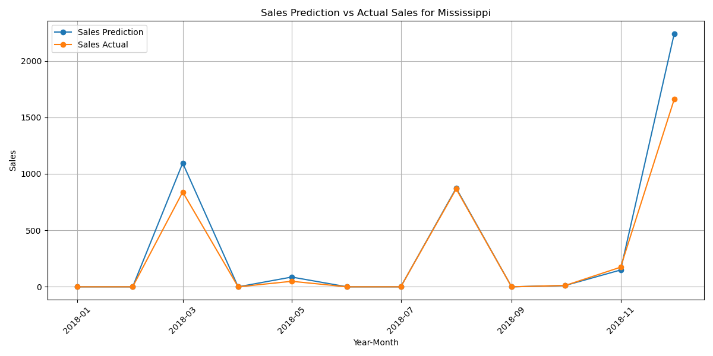

# Sales Forecasting Project

## Overview

Forecast sales data for different states. 
The workflow includes:
-  data **preprocessing** like handling missing values, 
- **training** using models like SARIMA,  XGBOOST and ..., 
-  **evaluating model performance** using MSE, RMSE, MAE and ...

Additionally, the project generates and saves visualizations of the sales predictions compared to actual sales data.

## Table of Contents

1. [Data Preparation](#data-preparation) 
2. [Top-Down Approach](#top-down-approach)     
- [Modeling with SARIMA](#modeling-with-sarima) 
    - [Evaluation](#evaluation)
   - [Metrics Calculation](#metrics-calculation)
   - [State-wise Evaluation](#state-wise-evaluation)
   - [Results Saving](#results-saving)
    - [Visualization](#visualization) 

- [Modeling with XGBoost](#modeling-with-xgboost)

## Data Preparation

1. **Data Loading**:

    - Use `Retailer Sales Data.csv`.

2. **Order Date nan Handling**: 

    - Handles missing values in `Order Date` by estimating based on the average shipping days.

3. **Sales Handling**:
   - Fills missing sales values using the average sales for the `Sub-Category` or `Category` is sub-cat is also missing
   
4. **State Handling**:
   - Fills missing values in the `State` column based on the `Customer ID` and `Country`.

#  Top-Down Approach

1. **Data Aggregation**:
   - Aggregates sales data by `Year-Month` and `State`.

2. **Train-Test Split**:
   - Splits the data into training and testing datasets based on the date.
3. **Proportion of Forecasting by States Based on Previous Sales Year**
    - Generate state-specific forecasts that are aligned with historical sales trends

## Modeling w SARIMA Model

Defines and trains a SARIMA model on the training data and makes forecasts for the test period.

### Evaluation

1. **Metrics Calculation**:
   - Computes Mean Squared Error (MSE), Root Mean Squared Error (RMSE), and Mean Absolute Error (MAE) for the overall sales forecast.

2. **State-wise Evaluation**:
   - Calculates evaluation metrics for each state by comparing predicted and actual sales.

3. **Results Saving**:
   - Saves the evaluation results (MSE, RMSE, MAE) in sarima_state_metrics.csv

## Modeling w XGBOOSTING Model

# Bottom Up approach
## Modeling w LSTM

### LSTM Implementation

1. **Data Preparation for LSTM**:
   - The sales data was transformed into a 3D structure (samples, time steps, features). Each sample corresponds to a sequence of sales data. included sub-category data as features, which provided more granularity in our predictions.

2. **Model Architecture**:

 lstm_2 (LSTM)               (None, 1, 100)            66000     
                                                                 
 dropout_2 (Dropout)         (None, 1, 100)            0         
                                                                 
 lstm_3 (LSTM)               (None, 100)               80400     
                                                                 
 dropout_3 (Dropout)         (None, 100)               0         
                                                                 
 dense_1 (Dense)             (None, 1)                 101       
                                                           

3. **Training**:
   - The model was trained using the training dataset for a specified number of epochs, with batch sizes adjusted to optimize performance. The mean squared error (MSE) was used as the loss function, and the Adam optimizer was employed for efficient training.

4. **Evaluation**:
### Predictions and Aggregation

- Initially, we predicted sales at the sub-category level, allowing the model to learn and capture detailed trends within each sub-category. This granularity is crucial as it helps in understanding how different products contribute to overall sales.
- After making predictions for all sub-categories, we aggregated the results at the state level. This step provided a comprehensive view of sales forecasts by state, aligning with the project's overall objective.

# Models Visualization

Creates plots comparing predicted and actual sales for each state.
Saves plots in a directory named `*models name*_state_sales_figures`.

**SARIMA: sales for mississippi**

**XGBOOST sales for mississippi**

**LSTM sales for mississippi**

