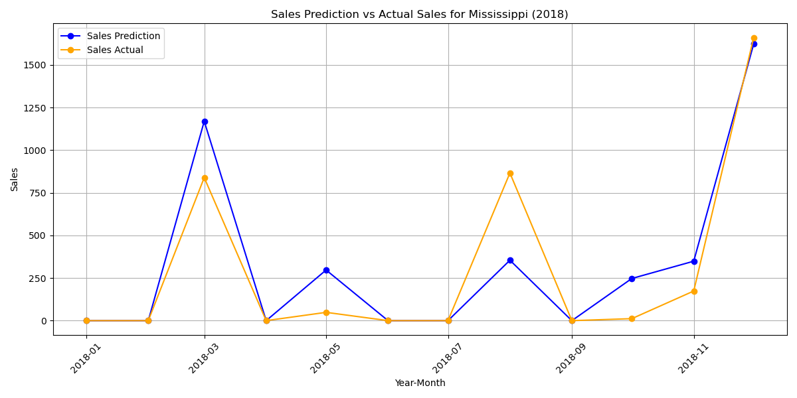

# Retailer Sales Data Forecasting

## Table of Contents
- [Overview](#overview)
- [Dataset](#dataset)
- [Objective](#objective)
- [Methodology](#methodology)
  - [Part 1: Top-Down Approach](#part-1-top-down-approach)
    - [1. Data Aggregation](#1-data-aggregation)
    - [2. SARIMA Model Training](#2-sarima-model-training)
    - [3. Sales Disaggregation](#3-sales-disaggregation)
    - [4. Model Evaluation](#4-model-evaluation)
  - [Part 2: Bottom-Up Approach](#part-2-bottom-up-approach)
    - [1. Data Encoding and Scaling](#1-data-encoding-and-scaling)
    - [2. LSTM Model Development](#2-lstm-model-development)
    - [3. Model Evaluation](#3-model-evaluation-1)
  - [Ensemble Modeling](#ensemble-modeling)
- [Results](#results)
- [Evaluation Metrics](#evaluation-metrics)
- [Project Structure](#project-structure)
- [Installation](#installation)
- [Usage](#usage)
- [Dependencies](#dependencies)
- [Author](#author)

## Overview

This project focuses on forecasting the daily sales data of a US retailer at the state level over the next 12 months using historical sales data. The analysis employs both statistical and machine learning approaches to ensure robust and accurate predictions.

## Dataset

The dataset contains daily sales records of a US retailer with the following key features:
- *Order Date*: The date when the order was placed.
- *Ship Date*: The date when the order was shipped.
- *Sales*: The amount of sales for each order.
- *Sub-Category*: The sub-category of the product sold.
- *Category*: The main category of the product.
- *Customer ID*: Unique identifier for each customer.
- *State*: The US state where the sale was made.
- *Product ID*: Unique identifier for each product.
- *Product Name*: Name of the product.
- *Country*: Country of the sale.

Note: The dataset may contain missing values which are handled during the preprocessing phase.

## Objective

To forecast the total sales for each state over the next 12 months using historical sales data. This involves:
- Predicting sales data to a monthly granularity.
- Developing forecasting models using both statistical (SARIMA) and machine learning (LSTM) approaches.
- Evaluating and comparing model performances.
- Creating an ensemble model to leverage the strengths of individual models.

## Methodology

### Shared part: ETL
 1. Data Cleaning:
    - Handle missing values in 'Order Date' by estimating based on average shipping days.
    - Fill missing 'Sub-Category' values using the most frequent sub-category within the same 'Category'.
    - Impute missing 'State' information based on 'Customer ID' and 'Country'.
 2. Data Transformation:
    - Convert 'Order Date' and 'Ship Date' to datetime format.
    - Create a new 'Year-Month' column for monthly aggregation.

### Part 1: Top-Down Approach

#### 1. Data Aggregation
- *Objective*: Aggregate daily sales data to a year-month level.
- *Steps*:
  - Convert Order Date and Ship Date to datetime format.
  - Create a new column Year-Month for monthly aggregation.
  - Aggregate sales data by Year-Month and State.

#### 2. SARIMA Model Training
- *Objective*: Train a Seasonal ARIMA (SARIMA) model to forecast monthly sales.
- *Steps*:
  - Define SARIMA parameters considering seasonality (monthly data).
  - Fit the SARIMA model on the training data.
  - Handle warnings related to parameter estimation.

#### 3. Sales Disaggregation
- *Objective*: Disaggregate the aggregated sales forecasts back to the state level.
- *Steps*:
  - Calculate the proportion of sales by state for each month.
  - Allocate total forecasted sales to each state based on these proportions.

#### 4. Model Evaluation
- *Objective*: Assess the accuracy of the SARIMA model.
- *Steps*:
  - Generate forecasts for the next 12 months.
  - Plot forecasted vs actual sales.

### Part 2: Bottom-Up Approach

#### 1. Data Encoding and Scaling
- *Objective*: Prepare data for LSTM modeling.
- *Steps*:
  - Aggregate sales data by Year-Month, State, and Sub-Category.
  - Apply one-hot encoding to categorical variables.
  - Scale sales data using MinMaxScaler to normalize the values.

#### 2. LSTM Model Development
- *Objective*: Develop and train an LSTM neural network for sales forecasting.
- *Steps*:
  - Split data into training, validation, and test sets.
  - Define the LSTM architecture with multiple layers, dropout, batch normalization, and regularization.
  - Compile and train the model with early stopping to prevent overfitting.

```txt
Model: "sequential"
_______________________
 Layer (type)                Output Shape              Param #   
=================================================================
 lstm (LSTM)                 (None, 1, 100)            66000     
                                                                 
 dropout (Dropout)           (None, 1, 100)            0         
                                                                 
 batch_normalization (Batch  (None, 1, 100)            400       
 Normalization)                                                  
                                                                 
 lstm_1 (LSTM)               (None, 1, 100)            80400     
                                                                 
 dropout_1 (Dropout)         (None, 1, 100)            0         
                                                                 
 batch_normalization_1 (Bat  (None, 1, 100)            400       
 chNormalization)                                                
                                                                 
 lstm_2 (LSTM)               (None, 50)                30200     
                                                                 
 dropout_2 (Dropout)         (None, 50)                0         
                                                                 
 dense (Dense)               (None, 50)                2550      
                                                                 
 leaky_re_lu (LeakyReLU)     (None, 50)                0         
                                                                 
 dropout_3 (Dropout)         (None, 50)                0         
                                                                 
 dense_1 (Dense)             (None, 1)                 51        
                                                                 
=================================================================
Total params: 180001 (703.13 KB)
Trainable params: 179601 (701.57 KB)
Non-trainable params: 400 (1.56 KB)
_______________________
```

#### 3. Model Evaluation
- *Objective*: Evaluate the performance of the LSTM model.
- *Steps*:
  - Plot training and validation MAE and loss.
  - Generate predictions on the test set.
  - Inverse transform the scaled predictions to original scale.
  - Plot predicted vs actual sales for each state.

### Ensemble Modeling

- *Objective*: Combine SARIMA and LSTM predictions to enhance forecasting accuracy.
- *Steps*:
  - Merge predictions from both models.
  - Calculate a weighted ensemble of the predictions.
  - Evaluate the ensemble model using Mean Squared Error (MSE), Root Mean Squared Error (RMSE), and Mean Absolute Error (MAE).
  - Save evaluation metrics and plots for analysis.

## Results

The project provides comprehensive forecasts of monthly sales at the state level using both SARIMA and LSTM models. Additionally, an ensemble model combining both approaches offers improved accuracy. Detailed plots and evaluation metrics are generated for each state to facilitate performance comparison.

SARIMA


LSTM


ENSAMBLE


## Evaluation Metrics

For each forecasting model and the ensemble, the following metrics are calculated:
- *Mean Squared Error (MSE)*: Measures the average of the squares of the errors.
- *Root Mean Squared Error (RMSE)*: The square root of MSE, providing error magnitude in the same units as the target variable.
- *Mean Absolute Error (MAE)*: The average of absolute errors, offering a straightforward measure of prediction accuracy.

These metrics are computed for both individual models and the ensemble to assess performance comprehensively.

## Project Structure

Retailer-Sales-Forecasting/
├── data/
│ └── Retailer Sales Data.csv
├── figures/
│ ├── sarima_state_sales_figures/
│ ├── lstm_state_sales_figures/
│ └── ensemble_state_sales_figures/
├── models/
│ └── lstm_model.h5
├── notebooks/
│ └── Retailer Sales Data Forecasting.ipynb
├── outputs/
│ ├── models_results_outputs.csv
│ └── models_results_outputs_state.csv
├── README.md
└── requirements.txt


- *data/*: Contains the raw dataset.
- *figures/*: Stores all generated plots for SARIMA, LSTM, and Ensemble models.
- *models/*: Saves trained machine learning models.
- *notebooks/*: Jupyter notebook with the complete analysis.
- *outputs/*: CSV files with evaluation metrics.
- *README.md*: This documentation.
- *requirements.txt*: List of Python dependencies.

    

## Dependencies

The project relies on the following Python libraries:

- *Data Handling and Manipulation*
  - pandas
  - numpy
  - os

- *Visualization*
  - matplotlib
  - visualkeras

- *Machine Learning and Modeling*
  - scikit-learn
  - statsmodels
  - keras (with TensorFlow backend)

- *Others*
  - keras.callbacks.EarlyStopping

Ensure all dependencies are installed by running:
bash
pip install -r requirements.txt


